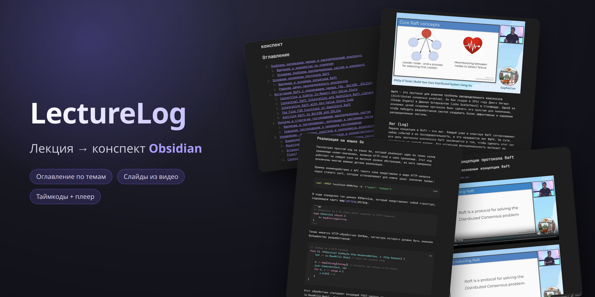

# LectureLog

<p align="center">
  
</p>

HTTP-сервис обработки лекций: на вход — лекция в виде аудиозаписи, видеофайла или
ссылки на видео (YouTube/HTTP), опционально + слайды PDF/PPTX; на выходе —
структурированный конспект в формате Obsidian (Markdown + нарезанные
медиафрагменты + слайды), упакованный в ZIP.

## Что умеет

1. **Приём медиа**: аудиофайл, видеофайл или URL видео (скачивается через yt-dlp);
   для видео извлекается аудиодорожка для транскрибации.
2. **Транскрибация** аудио в SRT через Groq Whisper (нарезка на чанки, ротация ключей при rate limit).
3. **Слайды** — три источника: из приложенного PDF/PPTX (pymupdf + LibreOffice),
   автоматически из видеоряда через Gemini Vision, либо без слайдов (флаг `no_slides`).
4. **Структуризация** транскрипта на темы и подтемы через Gemini, с привязкой слайдов.
5. **Нарезка медиа** по секциям конспекта через ffmpeg (аудио- или видеофрагменты).
6. **Экспорт** в ZIP: `конспект.md` (с виджетом плеера Obsidian) + медиафрагменты + слайды.

Состояние задач хранится в Postgres и переживает рестарт сервиса. Зависшие после рестарта
задачи автоматически помечаются как `interrupted`. Несколько лекций обрабатываются параллельно
(лимит — `MAX_CONCURRENT_TASKS`), остальные ждут в очереди.

### Режимы слайдов

- **видео без слайдов-документа** → слайды извлекаются автоматически из видеоряда (Gemini Vision);
- **приложен PDF/PPTX** (`slides`) → слайды берутся из документа (документ приоритетнее видео);
- **флаг `no_slides`** → слайды не делаются.

Для аудио слайды есть только при приложенном документе.

## Результат в Obsidian

Внутри ZIP — `конспект.md` и подкаталоги с нарезанными аудиофрагментами и слайдами.
Распакуйте архив в свой Obsidian-vault и откройте `конспект.md`.

Для каждой секции конспекта встроен виджет аудиоплеера: соответствующий фрагмент лекции
можно прослушать прямо из заметки. Виджет рендерится плагином
**[Audio Player](obsidian://show-plugin?id=obsidian-audio-player)** — установите его в
Obsidian (Settings → Community plugins), иначе вместо плеера будет виден сырой код-блок
` ```audio-player `.

### Пример конспекта

Готовый пример — конспект доклада **Philip O'Toole «Build Your Own Distributed System Using Go»**
([оригинал на YouTube](https://youtu.be/8XbxQ1Epi5w)), собранный в видео-режиме: оглавление по темам,
слайды из видеоряда, таймкоды с встроенным плеером и нарезанные видеофрагменты.

**[⬇ Скачать пример (ZIP, ~154 МБ)](https://github.com/fUS1ONd/LectureLog/releases/latest)**

Распакуйте архив в Obsidian-vault и откройте `конспект.md`.

## Запуск

Запуск через Docker Compose:

```bash
cp .env.example .env          # впишите реальные GROQ_API_KEYS и GEMINI_API_KEYS
docker compose up --build
```

Поднимутся сервисы: `db` (Postgres 16), `minio` (S3-хранилище лекций), `minio-init`
(разовое создание бакета и применение lifecycle-правил — см. ниже) и `api`. Миграции применяются
автоматически на старте контейнера. По умолчанию MinIO наружу не выставлен (`S3_PUBLIC_ENDPOINT`
не задан) — движок ходит к нему по internal-endpoint внутри docker-сети, presigned-эндпоинты
выключены, работает автономно. API доступен на `http://localhost:8000`.

Сервис `minio-init` (скрипт `docker/minio-init.sh`) идемпотентно настраивает lifecycle (ILM)
бакета `lectures`: `uploads/` — Expiration 7 дней и AbortIncompleteMultipartUpload 1 день
(чистка сырых исходников и orphan-частей оборванных presigned-заливок); `results-tmp/` —
Expiration 1 день (временные ZIP от `/result-url`). Префикс `results/` (постоянные результаты)
правил НЕ имеет и живёт до явного `DELETE /tasks/{id}`. Образы MinIO/mc запинены по тегам
релизов (а не `:latest`) для воспроизводимости.

В образе уже присутствуют системные зависимости видео-режима: `ffmpeg`/`ffprobe`
(нарезка фрагментов и извлечение кадров) и `yt-dlp` (скачивание видео по URL).

Проверка:

```bash
curl http://localhost:8000/api/v1/health
# {"status":"ok"}
```

### VPS: готовый образ из GHCR

Основной prod-like сценарий для быстрой проверки — готовый Docker image из GHCR,
без сборки исходников на сервере. Каналы образов:

| Docker tag | Откуда берётся | Назначение |
|---|---|---|
| `dev` | каждый push в git-ветку `dev` | быстрый прод-чек текущей разработки |
| `latest` | git tag `v*` | стабильный релиз |
| `vX.Y.Z` | git tag `vX.Y.Z` | воспроизводимый релиз |

`latest` — это Docker-тег, не git-ветка. Стабильный код живёт в `main`, активная
разработка — в `dev`.

Минимальное развёртывание core на VPS:

```bash
mkdir -p /opt/lecturelog-core
cd /opt/lecturelog-core
curl -fsSLo docker-compose.yml https://raw.githubusercontent.com/LectureLog/lecturelog-core/refs/heads/dev/deploy/compose.vps.yml
curl -fsSLo .env https://raw.githubusercontent.com/LectureLog/lecturelog-core/refs/heads/dev/deploy/env.core.example
curl -fsSLo minio-init.sh https://raw.githubusercontent.com/LectureLog/lecturelog-core/refs/heads/dev/deploy/minio-init.sh
chmod +x minio-init.sh
docker network create lecturelog-shared || true
```

Отредактируйте `.env`: задайте `GROQ_API_KEYS`, `GEMINI_API_KEYS`,
`CORE_POSTGRES_PASSWORD`, `S3_SECRET_KEY`, публичный `S3_PUBLIC_ENDPOINT` и общий
с web `LECTURELOG_WEBHOOK_SECRET`. Для связки с web укажите:

```env
PLATFORM_CALLBACK_URL=https://app.example.com/webhooks/core
S3_PUBLIC_ENDPOINT=https://files.example.com
```

Затем запустите:

```bash
docker compose pull
docker compose up -d
docker compose logs -f api
```

Для dev-проверки оставьте `LECTURELOG_CORE_IMAGE_TAG=dev`. Для стабильного канала
используйте `latest`, для воспроизводимого деплоя — конкретный тег, например
`v0.2.0`.

API и MinIO публикуются только на `127.0.0.1`; публичный HTTPS-доступ должен идти
через nginx/caddy. Core подключается к общей Docker-сети `lecturelog-shared`, чтобы
web мог обращаться к API по `http://lecturelog-core-api:8000`.

### Выпуск релиза

1. Проверьте, что `dev` зелёный и его образ `:dev` проверен на VPS.
2. Перенесите проверенный код в `main`.
3. Поставьте semver-тег и отправьте его в GitHub:

```bash
git checkout main
git merge --ff-only dev
git tag v0.2.0
git push origin main v0.2.0
```

GitHub Actions соберёт `ghcr.io/lecturelog/lecturelog-core:v0.2.0`,
обновит `ghcr.io/lecturelog/lecturelog-core:latest` и создаст GitHub Release.

## API

Базовый префикс — `/api/v1`.

### Машиночитаемый контракт (OpenAPI)

Схема API доступна в машинном виде и служит источником правды для генерации
типизированного клиента в platform-api.

- **Живая схема** (при запущенном сервере): `GET /openapi.json` — сама спека,
  `/docs` — Swagger UI, `/redoc` — ReDoc. Эти эндпоинты FastAPI отдаёт на корне,
  вне префикса `/api/v1`.
- **Снапшот в репозитории**: `docs/openapi.json` — закоммиченная актуальная версия
  схемы (типы `usage` в `GET /tasks/{id}`, коды ответов, `summary`/`tags`).
- **Регенерация локально**: `python scripts/export_openapi.py` обновляет
  `docs/openapi.json` без запуска сервера и без реальных секретов (используются
  env-заглушки).
- **Проверка в CI**: джоба `openapi` сверяет снапшот с кодом
  (`git diff --exit-code`) — если API изменился, а схему не перегенерировали,
  сборка краснеет.
- **Внеконтрактные флоу**: `docs/api-contract.md` описывает то, чего нет в OpenAPI
  by design — presigned-загрузку/скачивание, исходящий вебхук, два endpoint'а
  MinIO, HMAC-контур доверия и автономные режимы.

| Метод  | Путь                                     | Описание                                                                                                                                         |
| ------ | ---------------------------------------- | ------------------------------------------------------------------------------------------------------------------------------------------------ |
| `POST` | `/tasks`                                 | Создать задачу. multipart: ровно один источник — `audio` (file) / `video` (file) / `video_url` (form) / `s3_key` (form, ссылка на загруженный в MinIO объект под `uploads/`; для него ещё `media`: `audio`\|`video`); опционально `slides` (file) и `no_slides` (form, bool). Возвращает `{"task_id": "<hex>"}`. |
| `POST` | `/uploads`                               | Выдать presigned PUT URL для загрузки исходника платформой в `uploads/`. Тело: `{filename}`. Ответ: `{key, url, expires_in}`. `409`, если `S3_PUBLIC_ENDPOINT` не задан. |
| `GET`  | `/tasks/{id}`                            | Статус задачи: `{task_id, stage, progress_pct, error, error_code, result_path, usage}`. `result_path` — S3-префикс папки результата (`results/<task_id>/`). `error_code` — машинный код ошибки (enum, `null` вне ошибочного статуса). `usage` — разбивка расхода ресурсов по стадиям и моделям (см. ниже). |
| `GET`  | `/tasks/{id}/transcript?format=srt\|txt` | Транскрипт (SRT или plain text).                                                                                                                 |
| `GET`  | `/tasks/{id}/result`                     | Готовый ZIP (`application/zip`), собирается НА ЛЕТУ из объектов под `results/<task_id>/` и стримится клиенту (MinIO клиенту не виден; дефолт для консоли/автономии).                                            |
| `GET`  | `/tasks/{id}/result-url`                 | Presigned GET URL на ZIP результата: `{url, expires_in}`. ZIP собирается во временный объект `results-tmp/<task_id>/<uuid>.zip` (его чистит lifecycle MinIO / DELETE). Опц. параметр `filename` зашивается в `Content-Disposition` (имя `<filename>.zip`). `409`, если `S3_PUBLIC_ENDPOINT` не задан; `404`, если результат не готов. |
| `DELETE` | `/tasks/{id}`                          | Идемпотентно удалить задачу: чистит объекты в MinIO (весь префикс `results/<task_id>/`, временные `results-tmp/<task_id>/` и связанный `uploads/`-исходник) и строку в БД. Повтор на уже удалённую/неизвестную задачу → `204`. |
| `GET`  | `/health`                                | Healthcheck.                                                                                                                                     |

### Коды ответов

- `POST /tasks`: `200` — успех; `400` — не ровно один источник, `video_url` без http/https-схемы, `media` не `audio`/`video` или `s3_key` вне `uploads/`.
- `POST /uploads`: `200` — `{key, url, expires_in}`; `409` — `S3_PUBLIC_ENDPOINT` не задан.
- `GET /tasks/{id}`: `200` — статус; `404` — задача не найдена.
- `GET /tasks/{id}/result-url`: `200` — `{url, expires_in}`; `409` — `S3_PUBLIC_ENDPOINT` не задан; `404` — результат не готов.
- `GET /tasks/{id}/transcript`:
  - `400` — `format` не `srt`/`txt`: `{"error":"invalid_format","allowed":["srt","txt"]}`
  - `404` — задачи нет: `{"error":"task_not_found"}`
  - `409` — упало на транскрибации: `{"error":"transcribe_failed","detail":"..."}`
  - `202` — ещё не готово: `{"status":"in_progress","stage":...,"progress":...}`
  - `200` — готово (SRT-файл или plain text).
- `GET /tasks/{id}/result`: `200` — ZIP; `404` — результат не готов / файл не найден / задачи нет.
- `DELETE /tasks/{id}`: `204` — задача и её объекты удалены (идемпотентно, в т.ч. на неизвестную задачу).

### Учёт расхода ресурсов (`usage`)

Ответ `GET /tasks/{id}` содержит поле `usage` — JSON с разбивкой потраченных ресурсов
по стадиям и моделям (стадия × модель). Это ядро движка, а не платформенная фича, поэтому
видно всем клиентам, включая консольный режим. Накапливается инкрементально по мере прохождения
стадий: на `failed`/`interrupted` содержит частично накопленное.

- `transcribe` — `{audio_seconds, provider, model}`.
- `structurize`, `video_slides` — `{provider, by_model: {<model>: {prompt, output, calls}}}`
  (стадия `video_slides` присутствует только если слайды извлекались из видеоряда).
- `total` — сводка: `{audio_seconds, gemini_prompt, gemini_output, source, slides_origin}`,
  где `source` — `audio`\|`video`, а `slides_origin` — `none`\|`document`\|`video_extracted`.

### Вебхук на терминальные события (опционально)

Если задан `PLATFORM_CALLBACK_URL`, на каждое терминальное событие лекции (`done`/`failed`/`interrupted`)
движок шлёт одну исходящую `POST` — fire-and-forget, с коротким таймаутом и без ретраев.
Без `PLATFORM_CALLBACK_URL` движок работает автономно как раньше (поллинг `GET /tasks/{id}` всегда доступен).

Тело тонкое — `{task_id, status, error, error_code}` (`status`: `done`\|`failed`\|`interrupted`; ключи
`error`/`error_code` присутствуют всегда, вне ошибочного статуса — `null`); полное состояние
(`usage`, `result_path`) платформа добирает через `GET /tasks/{id}`. Тело подписывается
HMAC-SHA256 секретом `LECTURELOG_WEBHOOK_SECRET`, подпись — в заголовке `X-Webhook-Signature`.

### Хранилище и загрузка через MinIO

Исходники и результаты лежат в S3-совместимом хранилище (MinIO): исходники — под `uploads/`,
результат — папкой `results/<task_id>/` (отдельные объекты `output/...` + нейтральное дерево
`structure.json`); единый ZIP не хранится, а собирается на лету при скачивании. Временные ZIP
от `/result-url` складываются под `results-tmp/<task_id>/`. Возможны два сценария.

- **Автономный (дефолт)**: исходник передаётся multipart-файлом в `POST /tasks`, результат
  забирается стримом через `GET /tasks/{id}/result`. MinIO наружу не выставлен, presigned-ссылки
  не нужны — так работает консольный клиент.
- **С платформой**: платформа берёт presigned PUT через `POST /uploads`, грузит объект в `uploads/`
  напрямую в MinIO, затем создаёт задачу через `POST /tasks` с `s3_key`; готовый результат отдаётся
  presigned GET через `GET /tasks/{id}/result-url`. Активно только при заданном `S3_PUBLIC_ENDPOINT`.

### Клиентский скрипт

Вместо сырых `curl`-запросов удобнее пользоваться `scripts/submit_task.py` — клиентом
на чистой стандартной библиотеке (без внешних зависимостей). Базовый URL берётся из
переменной окружения `LECTURELOG_URL` или флага `--base` (по умолчанию
`http://localhost:8000/api/v1`).

```bash
# аудио (+ опционально слайды) -> печатает task_id
python scripts/submit_task.py submit --audio lecture.mp3 --slides slides.pdf

# видео (слайды извлекаются из видеоряда автоматически)
python scripts/submit_task.py submit --video lecture.mp4
python scripts/submit_task.py submit --video-url "https://youtu.be/abc"

# видео без слайдов
python scripts/submit_task.py submit --video lecture.mp4 --no-slides

# разовый статус
python scripts/submit_task.py status <task_id>

# опрашивать статус, пока задача не завершится (done/failed)
python scripts/submit_task.py poll <task_id>

# скачать готовый ZIP
python scripts/submit_task.py result <task_id> -o out.zip

# забрать транскрипт (srt|txt)
python scripts/submit_task.py transcript <task_id> --format txt
```

Если API поднят не на localhost, укажите адрес:

```bash
export LECTURELOG_URL=http://my-host:8000/api/v1
# или разово:
python scripts/submit_task.py --base http://my-host:8000/api/v1 status <task_id>
```

#### Команды

| Команда      | Аргументы                                   | Что делает                                                                      |
| ------------ | ------------------------------------------- | ------------------------------------------------------------------------------- |
| `submit`     | ровно один из `--audio <файл>` / `--video <файл>` / `--video-url <url>`; опционально `--slides <файл>`, `--no-slides` | Создаёт задачу из аудио/видео и опциональных слайдов. Печатает `task_id`. |
| `status`     | `<task_id>`                                 | Разовый запрос статуса задачи, печатает JSON-ответ.                              |
| `poll`       | `<task_id>`, `--interval <сек>` (по умолч. 3) | Опрашивает статус с заданным интервалом, пока задача не завершится (`done`/`failed`). |
| `result`     | `<task_id>`, `-o/--output <файл>` (по умолч. `result.zip`) | Скачивает готовый ZIP с конспектом на диск.                          |
| `transcript` | `<task_id>`, `--format srt\|txt` (по умолч. `srt`) | Печатает транскрипт в stdout (можно перенаправить в файл).                  |

Общий флаг `--base <url>` доступен у всех команд и переопределяет базовый URL API.

## Конфигурация

Переменные окружения (см. `.env.example`):

| Переменная             | Назначение                                                |
| ---------------------- | --------------------------------------------------------- |
| `GROQ_API_KEYS`        | Ключи Groq (через запятую), для транскрибации (см. раздел про лимиты бесплатных тиров). |
| `GEMINI_API_KEYS`      | Ключи Gemini (через запятую), для структуризации (см. раздел про лимиты бесплатных тиров). |
| `GEMINI_MODELS_*`      | Приоритетные списки моделей по этапам (fallback при 429). |
| `GEMINI_CONCURRENCY_*` | Параллельность вызовов Gemini по этапам.                  |
| `DATABASE_URL`         | Async-URL Postgres (`postgresql+asyncpg://...`).          |
| `S3_INTERNAL_ENDPOINT` | Endpoint MinIO для движка внутри docker-сети (напр. `http://minio:9000`). |
| `S3_PUBLIC_ENDPOINT`   | Опц. публичный хост для presigned-ссылок наружу. Не задан → presigned не выдаётся (`/uploads` и `/result-url` отдают 409), работает только стрим. |
| `S3_BUCKET`            | Бакет хранилища лекций.                                   |
| `S3_ACCESS_KEY`        | Access key MinIO/S3.                                      |
| `S3_SECRET_KEY`        | Secret key MinIO/S3.                                      |
| `S3_REGION`            | Регион S3 (по умолчанию `us-east-1`).                    |
| `S3_PRESIGN_EXPIRY`    | TTL presigned-ссылок в секундах (по умолчанию `3600`).   |
| `MAX_CONCURRENT_TASKS` | Сколько лекций обрабатывать одновременно.                 |
| `PLATFORM_CALLBACK_URL`| Опц. URL для вебхука на терминальные события. Не задан → движок работает автономно. |
| `LECTURELOG_WEBHOOK_SECRET` | Секрет для HMAC-SHA256 подписи тела вебхука (заголовок `X-Webhook-Signature`). |

## Ключи API и лимиты бесплатных тиров

Сервис рассчитан на работу на **бесплатных тарифах** Groq и Gemini. Чтобы обходить
жёсткие лимиты free tier, он умеет жонглировать несколькими API-ключами: ключи
перечисляются через запятую в `GROQ_API_KEYS` / `GEMINI_API_KEYS`, и пул автоматически
балансирует нагрузку между ними, помечая «перегретые» ключи и переключаясь на свободные.

Получить бесплатные ключи:

- Groq — [console.groq.com/keys](https://console.groq.com/keys)
- Gemini — [aistudio.google.com/apikey](https://aistudio.google.com/apikey)

### Groq (транскрибация, Whisper large-v3)

- Ключи из `GROQ_API_KEYS` образуют round-robin пул.
- При ответе `429` (rate limit) или `503` использованный ключ помечается «перегретым»
  и блокируется на **60 секунд** — пул автоматически переключается на следующий доступный ключ.
- Если все ключи временно заблокированы, запрос ждёт минимально необходимое время до
  освобождения ближайшего ключа.
- Чем больше ключей — тем выше суммарная пропускная способность транскрибации.

### Gemini (структуризация)

Балансировка идёт не просто по ключам, а по парам **«ключ × модель»**. Для каждой пары
учитываются два лимита бесплатного тира: **RPM** (запросов в минуту) и **RPD** (запросов
в сутки). Суточный счётчик сбрасывается в полночь по тихоокеанскому времени
(`America/Los_Angeles`) — именно так считает квоты сам Google.

Известные лимиты free tier на **один** ключ:

| Модель                    | RPM | RPD |
| ------------------------- | --- | --- |
| `gemini-3.5-flash`        | 5   | 20  |
| `gemini-3-flash-preview`  | 5   | 20  |
| `gemini-3.1-flash-lite`   | 15  | 500 |

- Модели для каждого этапа задаются приоритетным списком (`GEMINI_MODELS_*`). При
  исчерпании лимита или ответе `429` пул пробует следующую модель/ключ из списка — это и
  есть fallback.
- При ответе `429`/`503` конкретная пара «ключ × модель» помечается перегретой и временно
  блокируется; пул выбирает следующую доступную пару.
- Несколько ключей кратно увеличивают суммарный суточный бюджет запросов (RPD складывается
  по ключам), что критично на бесплатном тарифе.

## Тесты

```bash
pytest
```

Юнит-тесты гоняют репозиторий на SQLite in-memory, а инфраструктурные зависимости
(Groq/Gemini/ffmpeg) мокаются — реальные ключи и внешние сервисы для тестов не нужны.

## Линтер и форматтер

Код проверяется и форматируется через [Ruff](https://docs.astral.sh/ruff/):

```bash
ruff check .          # линтер
ruff format --check . # проверка форматирования (без правок)

ruff check --fix .    # автоисправление линт-ошибок
ruff format .         # отформатировать код
```

Настройки правил и форматирования — в `pyproject.toml` (секция `[tool.ruff]`).

## Архитектура

```
lecturelog/
  domain/          модели, enums, порты, исключения — без зависимостей от инфраструктуры
  application/     ProgressPlan, PipelineService (оркестрация), use-cases, PipelineWorker
  infrastructure/  реализации портов: transcribe, structurize, slides, media, export, persistence, llm
  api/             FastAPI: роуты, DTO, обработчики исключений, lifespan (composition root)
  config/          настройки через pydantic-settings
migrations/        Alembic
```

Поток обработки:
- **аудио**: `transcribe → slides → structurize → audio_cut → export`;
- **видео**: `ingest → extract_audio → transcribe → slides → structurize → video_cut → export`.

Выбор реализаций (нарезка, источник слайдов) инкапсулирован в фабриках, а не в ветвлениях
`if is_video` — `domain` не зависит от инфраструктуры, видео добавлено через реализации
тех же портов. Прогресс по стадиям инкапсулирован в `ProgressPlan`; статус персистится в
Postgres после каждого шага.
